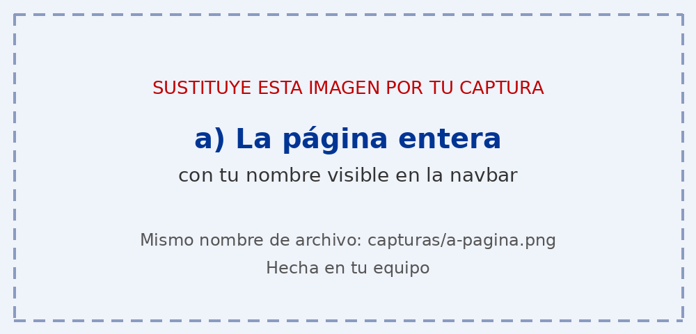
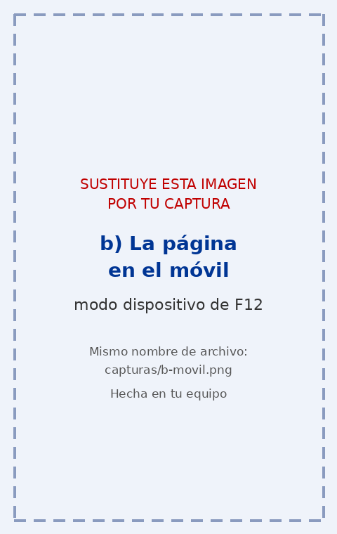
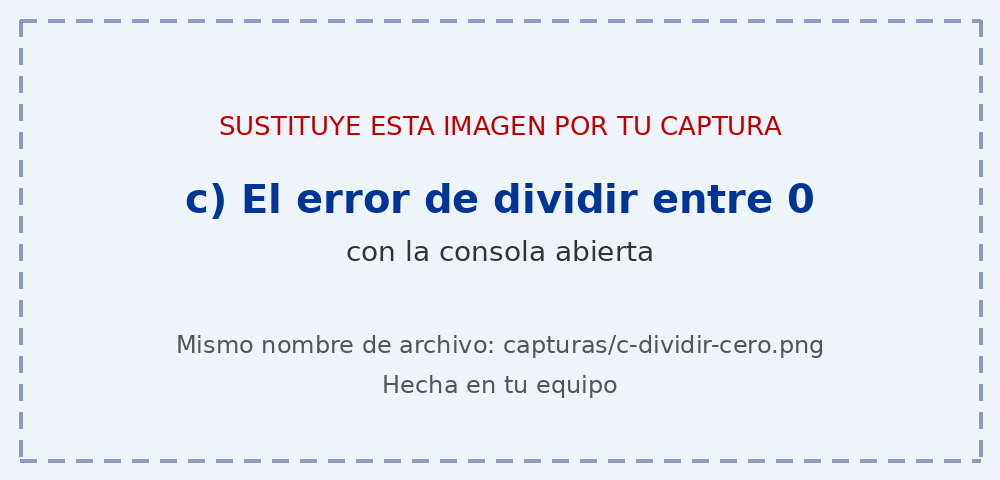
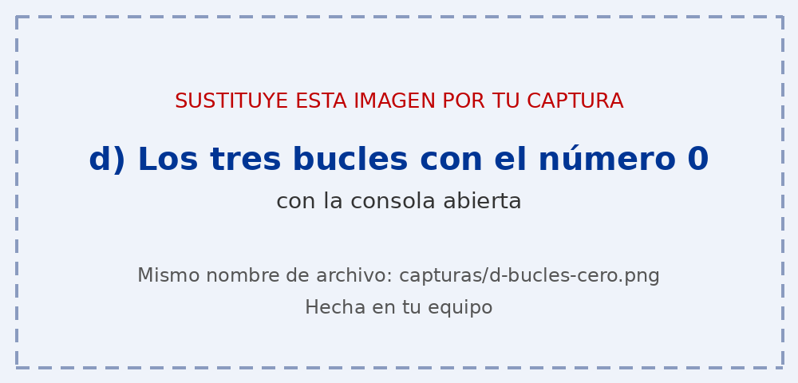
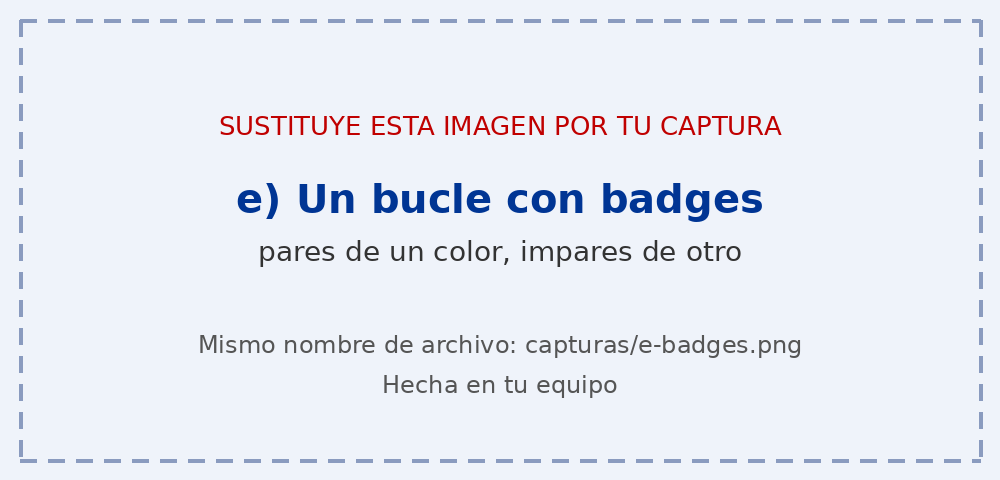

# Tarea 4 · Calculadora y bucles

**Autor:** [Tu nombre y apellidos] · Desarrollo Web en Entorno Cliente (DWEC) · 2.º DAW · Curso 2026-27

> **Plantilla de la tarea 4.** Cómo usarla:
>
> 1. Copia esta carpeta en tu repositorio de DWEC y cámbiale el nombre a `tema04`.
> 2. `index.html` trae lo imprescindible para empezar: las dos casillas, la zona de resultado y el botón «Sumar». El resto de la página y su maquetación con Bootstrap los haces tú.
> 3. `js/app.js` trae `sumar()` hecha como modelo y las demás funciones con `TODO`.
> 4. `js/ayudas.js` no se toca: son las funciones que leen las casillas y escriben el resultado.
> 5. Sustituye las imágenes de `capturas/` por las tuyas, **con el mismo nombre**.
> 6. Todo lo que va entre [corchetes] es un hueco: cámbialo por lo tuyo. Al terminar, borra este aviso.

[Una o dos líneas: qué hay en esta carpeta y cómo se ve. Por ejemplo: abrir la carpeta en VS Code, pulsar **Go Live**, escribir dos números y pulsar los botones con la consola abierta (F12).]

## Capturas

### a) La página entera

[Qué se ve: tu nombre en la navbar y cómo has repartido las cards con la rejilla.]

### b) La página en el móvil

[Qué cambia respecto a la pantalla grande.]

### c) El error de dividir entre 0

[Qué se ve en la página y en la consola.]

### d) Los tres bucles con el número 0

[Cuántas veces se repite cada bucle y por qué.]

### e) Un bucle con badges

[Qué número has puesto y cómo eliges el color de cada badge.]

## Reflexión

[De 5 a 8 líneas: ¿en qué se diferencian for, while y do…while y cuándo usarías cada uno? Pon como ejemplo lo que pasó con el 0.]

## Fuentes

- [Título de la página](https://enlace-a-la-fuente)

## Uso de IA

[Si has usado IA: qué herramienta, para qué y qué hiciste después con su respuesta. Si no la has usado, borra este apartado.]
